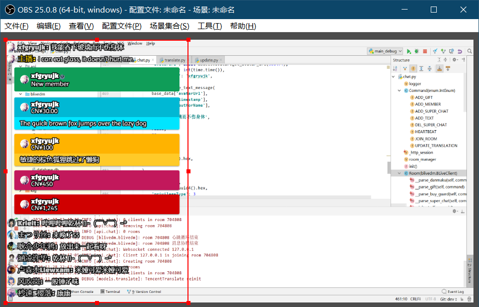
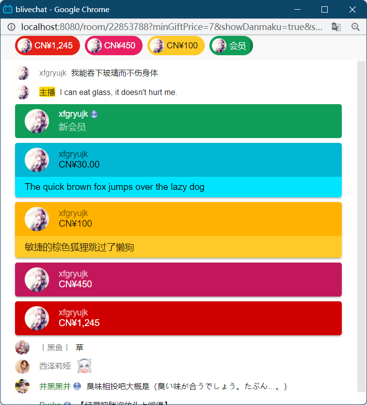
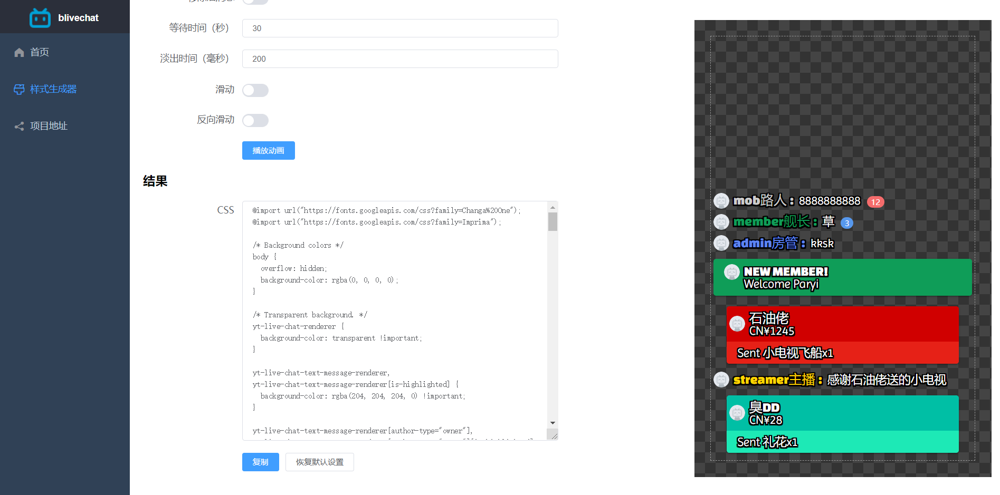

# blivechat

用于OBS的仿YouTube风格的bilibili直播评论栏







## 特性

* 兼容YouTube直播评论栏的样式
* 高亮舰队、 ~~房管~~ 、主播的用户名
* 自带两种样式生成器，经典YouTube风格和仿微信风格
* 支持屏蔽弹幕、合并礼物等设置
* 支持前端直连B站服务器或者通过后端转发
* 支持自动翻译弹幕、醒目留言到日语，可以在后台配置翻译目标语言
* 支持标注打赏用户名的读音，可选拼音或日文假名
* 支持配置自定义表情，不需要开通B站官方表情
* 支持插件开发

## 使用方法

以下几种方式任选一种即可

### 一、本地使用

1. 下载[本地分发版](https://github.com/xfgryujk/blivechat/releases)（仅提供x64 Windows版）。也可以在[B站商店](https://play-live.bilibili.com/details/1694397161340)下载
2. 双击`blivechat.exe`运行服务器。或者用命令行可以指定host和端口号：

    ```sh
    blivechat.exe --host 127.0.0.1 --port 12450
    ```

   或者也可以在配置文件里指定host和端口号

3. 用浏览器打开[http://localhost:12450](http://localhost:12450)，输入主播在开始直播时获得的身份码，复制房间URL
4. 用样式生成器生成样式，复制CSS
5. 在OBS中添加浏览器源，输入URL和自定义CSS

**注意事项：**

* 本地使用时不要关闭blivechat.exe那个黑框，否则不能继续获取弹幕
* 如果需要使用翻译功能，建议看[配置官方翻译接口教程](https://github.com/xfgryujk/blivechat/wiki/%E9%85%8D%E7%BD%AE%E5%AE%98%E6%96%B9%E7%BF%BB%E8%AF%91%E6%8E%A5%E5%8F%A3)

### 二、公共服务器

请优先在本地使用，因为公共服务器会禁用部分特性

* [公共服务器](http://chat.bilisc.com/)

### 三、源代码版（自建服务器或在Windows以外平台）

0. 由于使用了git子模块，clone时需要加上`--recursive`参数：

    ```sh
    git clone --recursive https://github.com/xfgryujk/blivechat.git
    ```

    如果已经clone，拉子模块的方法：

    ```sh
    git submodule update --init --recursive
    ```

1. 编译前端（需要安装Node.js）：

    ```sh
    cd frontend
    npm i
    npm run build
    ```

2. 运行服务器（需要Python3.8以上版本）：

    ```sh
    pip3 install -r requirements.txt
    python3 main.py
    ```

    或者可以指定host和端口号：

    ```sh
    python3 main.py --host 127.0.0.1 --port 12450
    ```

3. 用浏览器打开[http://localhost:12450](http://localhost:12450)，以下略

### 四、Docker（自建服务器）

1.  ```sh
    docker run --name blivechat -d -p 12450:12450 \
      --mount source=blivechat-data,target=/mnt/data \
      xfgryujk/blivechat:latest
    ```

2. 用浏览器打开[http://localhost:12450](http://localhost:12450)，以下略

## 服务器配置

服务器配置在`data/config.ini`，可以配置数据库和允许自动翻译等，编辑后要重启生效

**自建服务器时强烈建议不使用加载器**，否则可能因为混合HTTP和HTTPS等原因加载不出来

## 常用链接

* [文档](https://github.com/xfgryujk/blivechat/wiki)
* [交流社区](https://github.com/xfgryujk/blivechat/discussions)
* [B站商店](https://play-live.bilibili.com/details/1694397161340)
